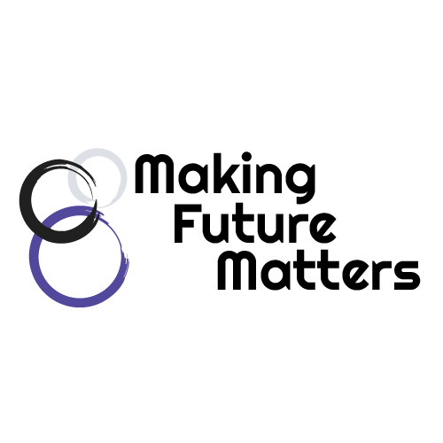

## Publications



## Editorial Work

### Kairos
I am an editor at Kairos: A Journal of Rhetoric, Technology, and Pedagogy.

### Making Future Matters
In 2017-18, I co-edited a born digital edited collection with Mary P. Sheridan. It was published by Computers and Composition Digital Press / Utah State University Press.

## Teaching



  <article class="post-card">
  <h4 class="post-list"><a href="{{ course.url }}">{{ course.title}}</a></h4>
  {{ post.date | date: "%b %-d, %Y" }}
  
{{ course.excerpt }}

  <a class="read-more" href="{{ post.url }}">Read More</a>
</article>


